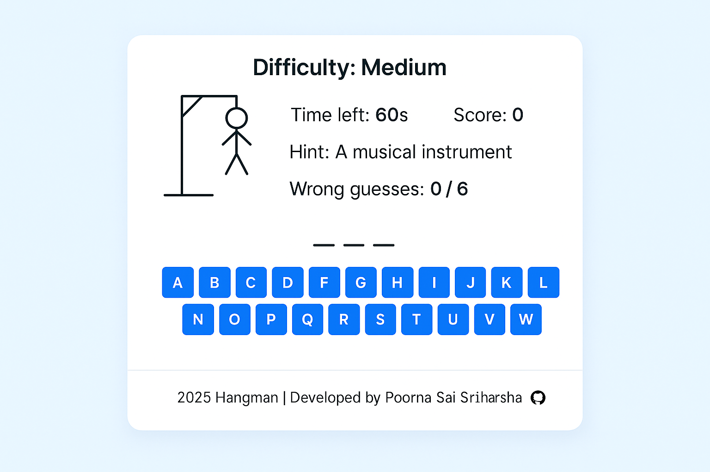

## 🎮 Hangman Game 
Developed Hangman, an interactive word-guessing game with HTML, CSS, and JavaScript. Engineered a responsive interface optimized for desktop and mobile, implementing dynamic word selection across difficulty levels, timer, and score tracking. Utilized CSS animations, grid layouts, and media queries for a seamless UI, demonstrating strong front-end development, game logic, and responsive design skills.

## 📸 Screenshots

## ✨ Features
- ✅ Interactive Gameplay: Guess letters to reveal a hidden word within 60 seconds.
- 📋 Difficulty Levels: Randomly selects from easy, medium, or hard word lists with hints.
- 🎯 Score Tracking: Earn points for each correctly guessed word.
- 🎨 Modern UI: Gradient backgrounds, smooth animations, and a responsive keyboard layout.
- 📱 Responsive Design: Adapts seamlessly to mobile, tablet, and desktop devices.
- 🔚 Game Over Modal: Displays win/loss status with the correct word and a "Play Again" option.

## 🧠 How It Works
- Word Selection: Randomly selects a word and hint from predefined lists (easy, medium, hard).
- Gameplay: Players guess letters via an on-screen keyboard or physical keyboard input. Correct guesses reveal letters; incorrect guesses advance the hangman image (up to 6 wrong guesses).
- Timer: 60-second countdown per game, ending in a loss if time runs out.
- Scoring: Awards one point per win, displayed on the UI.
- Responsive UI: Adapts to various screen sizes with CSS media queries and a flexible grid-based keyboard.
= Error Handling: Prevents invalid inputs and disables used letters.

## 🛠️ Built With
- HTML5: Semantic structure for the game layout.
- CSS3: Gradient backgrounds, responsive design, animations, and modal styling.
- JavaScript (ES6+): Core game logic, DOM manipulation, and event handling.
- Font Awesome: Icons for the footer (fontawesome.com).
- Google Fonts: Segoe UI for a clean, modern typography (fonts.google.com).

## 🧰 Getting Started
- To run Hangman Game locally:
- Clone the Repository:git clone https://github.com/Poorna-Sai-Sriharsha/Hangman-Game.git
- Navigate to the Project Directory:cd Hangman-Game
- Open the Application: Launch index.html in a browser or use a local server (e.g., npx live-server) for the best experience.
- Note: No external dependencies are required, as all libraries (Font Awesome) are included via CDNs.

## 🧪 Testing
- Tested for compatibility across Chrome, Firefox, Safari, and Edge.
- Verified responsive design on mobile (iOS, Android), tablets, and desktop devices.
- Ensured smooth keyboard input handling for both on-screen and physical keyboards.

## 📖 What I Learned
- Mastered dynamic DOM manipulation for real-time game updates.
- Implemented responsive design with CSS grid, flexbox, and media queries.
- Enhanced skills in JavaScript event handling and game logic development.
- Developed smooth animations and transitions for an engaging user experience.
- Improved error handling and accessibility for diverse devices and inputs.

## 🤝 Contributing
- Contributions are welcome! Please fork the repository and submit a pull request with your changes. For major updates, open an issue first to discuss your ideas. 

